# Git　training

---

## Gitとは

- **分散型バージョン管理システム**
- ファイルの変更履歴を記録・管理するためのツール
- 過去の任意の状態にファイルを戻すことが可能

---

## GitHubとは

- **Gitリポジトリをインターネット上で管理・共有するためのサービス**
- Gitで作成した履歴をクラウド上に保存し、チームで共同作業しやすくする
- Pull Requestを使って、コードレビューしながら安全に変更を取り込める
- Issueでタスク管理、ActionsでCI/CDの自動化など、開発を支える機能が豊富

---

## Google Drive / Notionとの違い

### Google Drive / Notion
資料・メモ・ドキュメントを**共同編集**する場所

### GitHub
履歴つきで安全に変更する場所
→ 変更案をつくり、差分を確認し、レビューしてから反映する

---

## Git管理に向いているもの / 向いていないもの

### Gitが得意なファイル
テキストファイル
→ 差分を行単位で見られるファイル
`.txt`, `.md`, `.html / .css / .js`, `.json / .yaml`, `.py/`

### Gitが苦手なファイル
中身の差分がどう変わったか、ファイルを開かないとわからないファイル
`.xlsx`, `.pptx`, `.docx`, `.pdf`, `.png / .jpg`

---

## なぜ変更管理が必要なのか？

- 変更履歴の追跡: 「いつ、誰が、どの部分を、なぜ変更したか」を明確にする
- 過去状態の復元: バグなどで元に戻したくなった時に、特定の時点の状態へ簡単に戻せる
- 複数人での共同作業: 同じファイルを複数人で同時編集しても、変更点を安全にマージできる

---

## リポジトリ

- **ローカルリポジトリ**
- 自分のPC内にあるGitの保存場所
- `commit` などの操作は、まずローカルリポジトリに記録される

- **リモートリポジトリ**
- GitHubなどのサーバー上にある共有用の保存場所
- `push` でローカルの変更を送信し、`pull` で最新状態を取得する

---


---

## よく使うGitコマンド集

---

### Clone: リモートリポジトリをローカルPCにコピー

```
git clone https:://github.com/xxxxx/xxxx.git
```

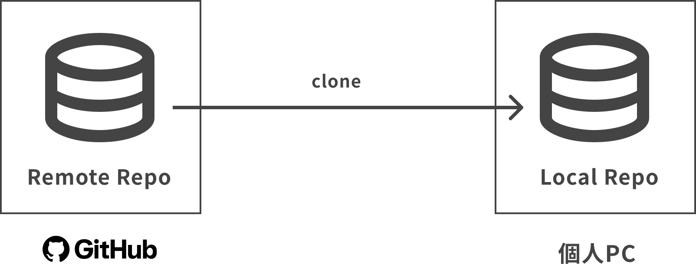

---

### Commit：　変更内容を履歴として保存する

コミット対象ファイルを指定
```
git add {path/to/file name}
```
ファイルの変更を保存
```
git commit -m '{commit message}'
```

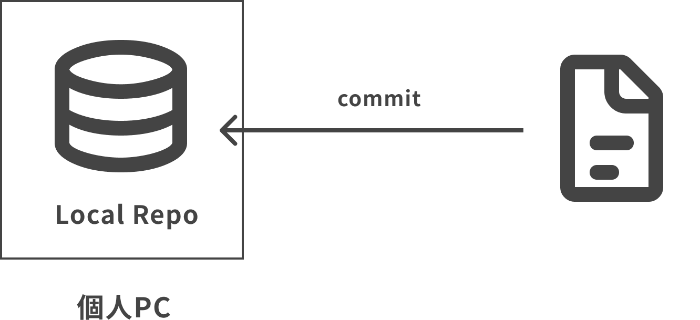

---

### Push: ローカルで行った変更をリモートリポジトリに送る

```
git push origin {branch name}
```

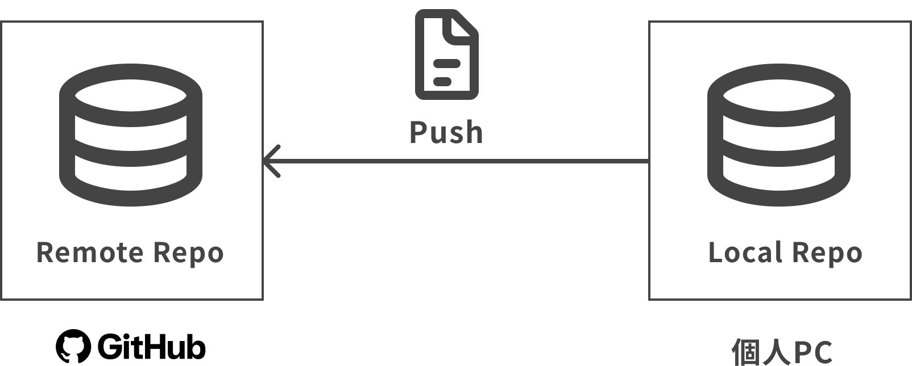

---

### Pull:リモートの最新をローカルに取り込む

```
git pull origin {branch name}
```

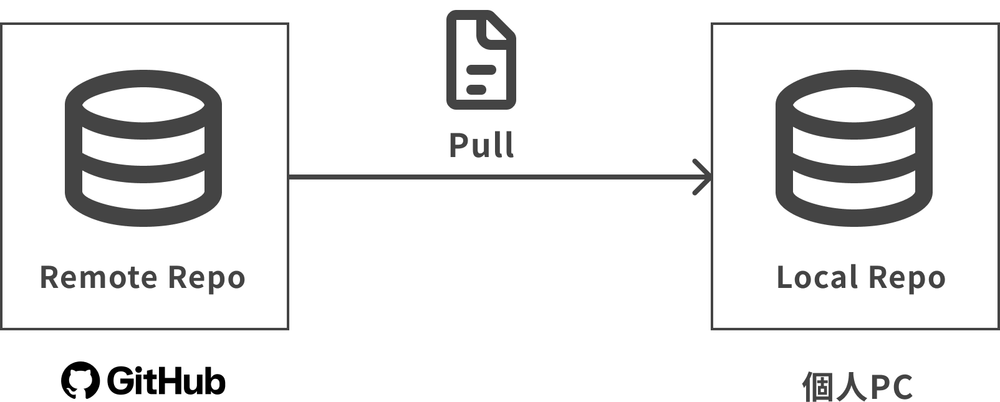

---

### Branch: 作業用の分岐をつくる

ブランチ作成 + ブランチ切り替え
```
git switch -c {branch name}
```
既存のブランチに切り替える
```
git switch {branch name}

# 下の図の例
git switch feature/login
```

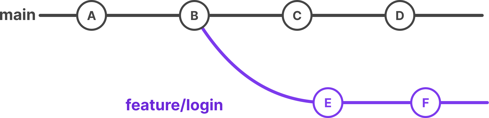

---

### Merge: 分岐したブランチを合流させる

```
git merge {マージ対象のブランチ名}

# 例
git merge feature/login

```

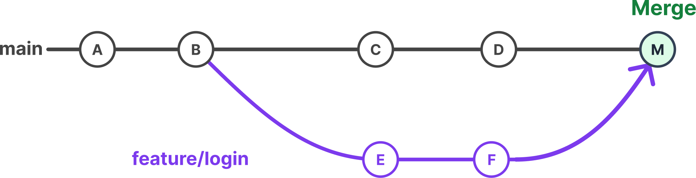

---

## GitHubでできること

--

### Pull Request: 変更内容をレビューし、取り込むかどうか判断する

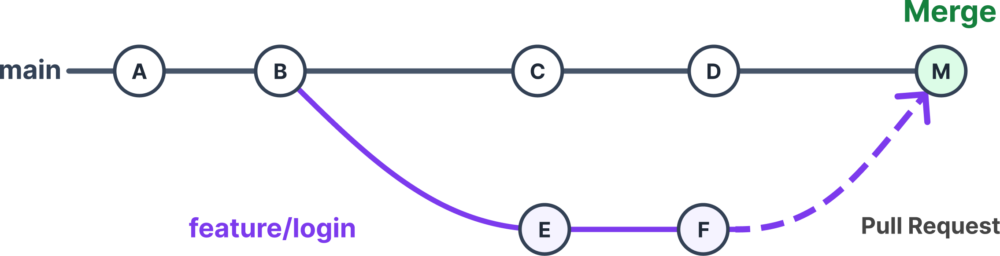

---

### Pull Requests

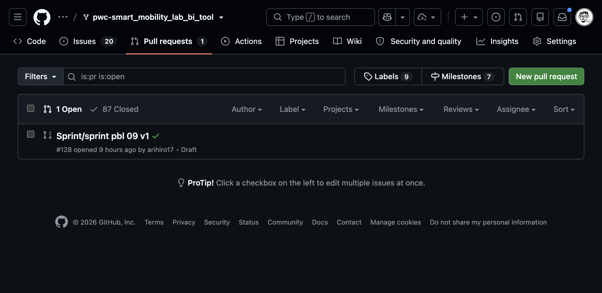

---

### GitHub でできること

---

### Code
リポジトリで管理しているファイルを見る

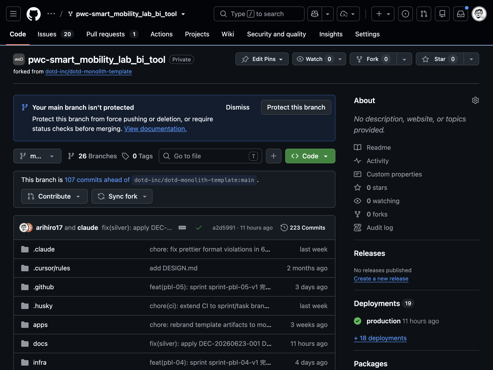

---

### Issues
タスク・相談・不具合・改善要望を管理する

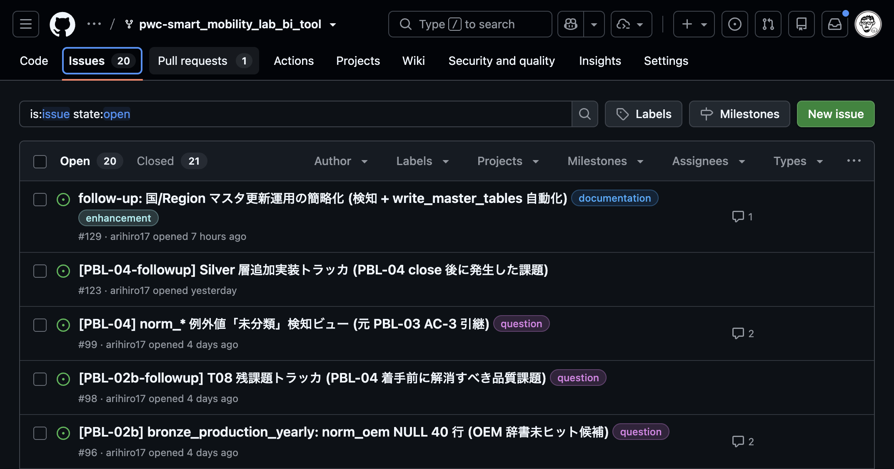


---

### Actions
テストやチェックなどの自動処理の結果を確認する

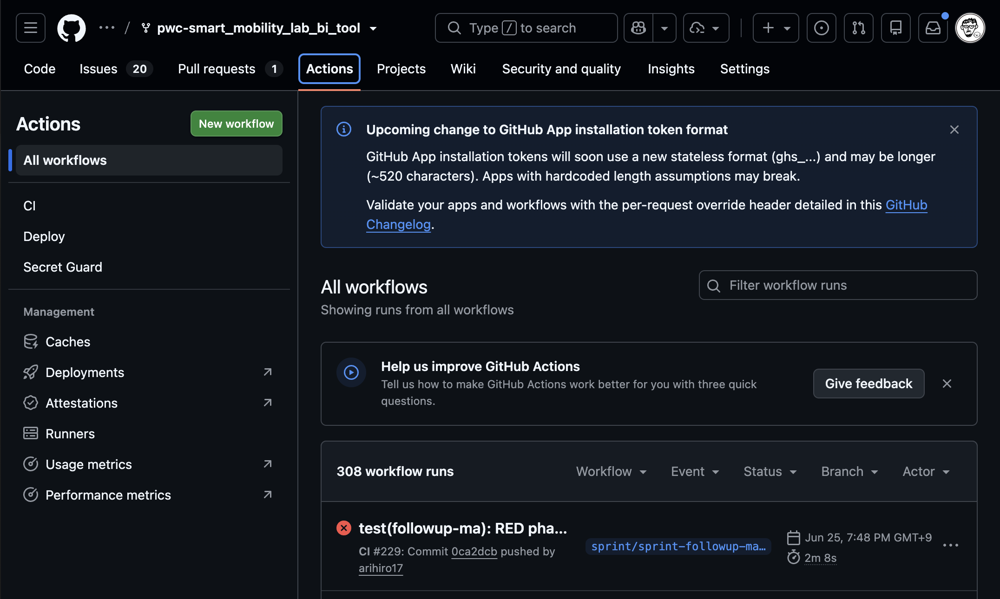


---

## おまけ　worktreeについて

---

## branch の欠点

ブランチはcommitしないと、別のブランチに移動できない
commit前にbranchを切り替えると、編集内容も移動先のbranchにつけ変わる

---

### Worktree: ローカルPC内で、ローカルリポジトリをクローンする

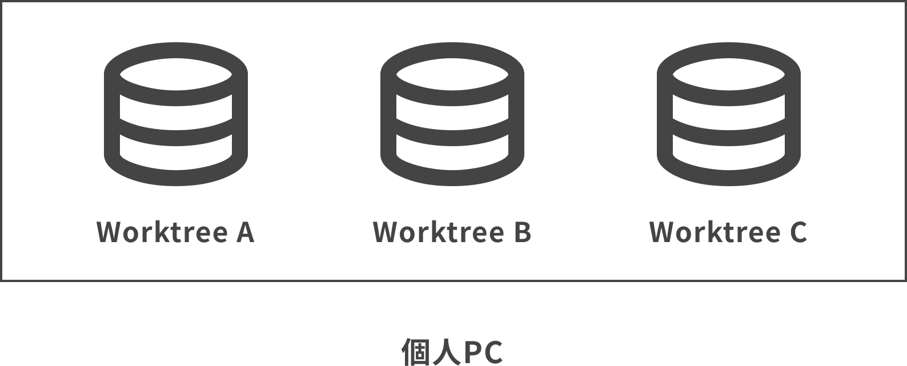


---

## ワークツリー作成

新しいworktreeを作成
```
# リポジトリrootで
git worktree add ../{worktree name}
```

既存のブランチをworktreeにする
```
git worktree add ../{worktree name} {branch name}
```

---

## ワークツリー削除

作業完了(commit/push)したら、ワークツリーを削除する
```
git worktree remove ../{worktree name}
```

