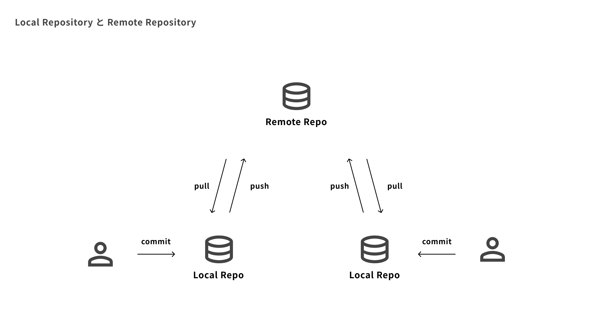

# git　training 01

---

## Gitとは

- **分散型バージョン管理システム**
- ファイルの変更履歴を記録・管理するためのツール
- 複数人での共同開発を効率的に行うことができる
- 過去の任意の状態にファイルを戻すことが可能

---

## GitHubとは

- **Gitリポジトリをインターネット上で管理・共有するためのサービス**
- Gitで作成した履歴をクラウド上に保存し、チームで共同作業しやすくする
- Pull Requestを使って、コードレビューしながら安全に変更を取り込める
- Issueでタスク管理、ActionsでCI/CDの自動化など、開発を支える機能が豊富

---

## リポジトリ

- **ローカルリポジトリ**
- 自分のPC内にあるGitの保存場所
- `commit` などの操作は、まずローカルリポジトリに記録される

- **リモートリポジトリ**
- GitHubなどのサーバー上にある共有用の保存場所
- `push` でローカルの変更を送信し、`pull` で最新状態を取得する

---



---

## よく使うコマンド集

---

### リモートリポジトリをローカルPCにコピー

```
git clone https:://github.com/xxxxx/xxxx.git
```
---

### ブランチの最新版をローカルリポジトリに反映

```
git pull origin {branch name}
```

---

### ブランチ作成 + ブランチ切り替え

```
git switch -c {branch name}
```

---

### ブランチ切り替え

```
git switch {branch name}
```
---

### 状態を確認

```
git status
```
---
### コミット対象のファイルを指定する

特定のファイル
```
git add {path/to/file name}
```

特定のディレクトリ内全部
```
git add {path/to/directory}/.
```

全ての変更ファイル
```
git add .
```
---
### コミットする(新しい版をつくる)

```
git commit -m '{commit message}'
```
---

### ローカルリポジトリの最新版をリモートリポジトリに反映

```
git push origin {branch name}
```

---


## おまけ　worktreeについて

---

## branch の欠点

作業ブランチは基本1つしか作れない
commit前にbranchを切り替えると、編集中のファイルもついてくる

---

## ワークツリー作成

新しいworktreeを作成
```
# リポジトリrootで
git worktree add ../{worktree name}
```

既存のブランチをworktreeにする
```
git worktree add ../{worktree name} {branch name}
```

---

## ワークツリー削除

作業完了(commit/push)したら、ワークツリーを削除する
```
git worktree remove ../{worktree name}
```

